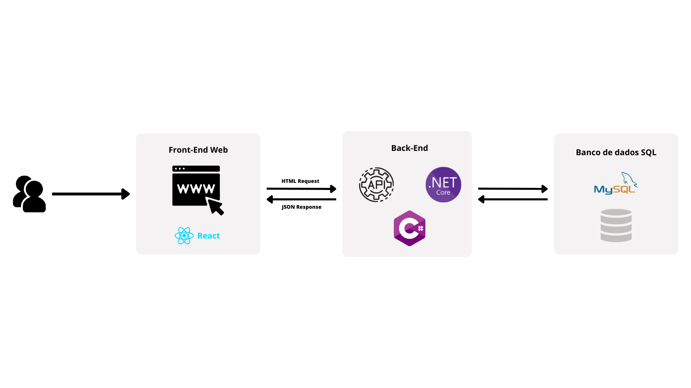

# Especificações do Projeto

Pré-requisitos: <a href="1-Documentação de Contexto.md"> Documentação de Contexto</a>

Definição do problema e ideia de solução a partir da perspectiva do usuário. É composta pela definição do diagrama de personas, histórias de usuários, requisitos funcionais e não funcionais além das restrições do projeto.

Apresente uma visão geral do que será abordado nesta parte do documento, enumerando as técnicas e/ou ferramentas utilizadas para realizar a especificações do projeto

## Arquitetura e Tecnologias

## Tecnologias:

### Linguagens de programação:

**Plataforma de Desenvolvimento:** .NET

- Utilizaremos a versão mais recente do .NET para garantir benefícios de desempenho e segurança.
- A escolha do .NET oferece suporte multiplataforma e uma ampla comunidade de desenvolvedores.

**Persistência de Dados:** Entity Framework

- O Entity Framework, em conjunto com o Pomelo, será adotado para gerenciar a camada de persistência de dados, facilitando a comunicação eficiente com o banco de dados MySQL.

**Comunicação com Banco de Dados MySQL:** Pomelo

- Utilizaremos o Pomelo EF Core MySQL para estabelecer uma conexão eficaz e otimizada com o banco de dados MySQL.

**Criptografia de Senhas:** BCrypt

- O BCrypt será implementado para garantir a segurança das senhas, utilizando técnicas modernas de criptografia.

**Frontend:** ReactJS

- Para o desenvolvimento do frontend, adotaremos o ReactJS, uma biblioteca JavaScript de código aberto mantida pelo Facebook, proporcionando uma experiência de usuário dinâmica e responsiva.

### Ferramentas utilizadas para desenvolvimento

IDE / Editor de código: Visual Studio Code e Visual Studio Community

Design: Figma, Canva

Versionamento: GitHub

Gerenciamento de Banco de dados: MySQL Workbench

Comunição da equipe: Microsoft Teams, WhatsApp, Discord

## **Modelo de Arquitetura:**

**Monolito:** Optamos por um modelo monolítico devido à simplicidade do projeto. Isso permitirá uma abordagem mais direta para o desenvolvimento e manutenção.

### **Benefícios Esperados:**

- **Produtividade Aprimorada:** A combinação do .NET, Entity Framework, Pomelo, BCrypt e ReactJS acelera o desenvolvimento, permitindo-nos focar mais nas funcionalidades centrais da API e do frontend.
- **Escalabilidade e Desempenho:** A plataforma .NET, juntamente com as otimizações proporcionadas pelo Pomelo, garantirá escalabilidade e desempenho eficientes na comunicação com o MySQL.
- **Segurança Avançada:** A utilização do BCrypt para criptografia de senhas garante uma camada adicional de segurança, protegendo as informações sensíveis.
![]
## Project Model Canvas

Colocar a imagem do modelo construído apresentando a proposta de solução.

> **Links Úteis**:
> Disponíveis em material de apoio do projeto

## Requisitos

### Requisitos Funcionais

| ID     | Descrição do Requisito                  | Prioridade |
| ------ | --------------------------------------- | ---------- |
| RF-001 | Garantir que o cliente tenha um acesso administrador | ALTA       |
| RF-002 | Permitir que o administrador altere o banner do site (CRUD)  | ALTA      |
| RF-003 | Permitir que o administrador adicione e edite os produtos do catálogo (CRUD)  | ALTA      |
| RF-004 | Permitir que o administrador classifique os produtos em diferentes categorias (CRUD)  | ALTA      |
| RF-005 | Disponibilizar a visualização do catálogo de produtos a todos os usuários  | ALTA      |
| RF-006 | Disponibilizar a visualização dos produtos de acordo com a categoria a todos os usuários  | ALTA      |
| RF-007 | Disponibilizar a comunicação direta com o empresário por meio do Whatsapp  | ALTA     |

### Requisitos não Funcionais

| ID      | Descrição do Requisito                                                              | Prioridade |
| ------- | ----------------------------------------------------------------------------------- | ---------- |
| RNF-001 | O sistema deve ser responsivo e compatível com os principais navegadores            | ALTA       |
| RNF-002 | Deve conter informações de horário de funcionamento, telefone de contato e endereço | ALTA       |
| RNF-003 | A aplicação deve ser intuitiva, de fácil utilização e entendimento                  | ALTA       |

## Restrições

| ID  | Restrição                                                                                          |
| --- | -------------------------------------------------------------------------------------------------- |
| 01  | O projeto deverá ser entregue até o final do semestre                                              |
| 02  | Não pode existir contratação de pessoal externo à equipe pré-definida                              |
| 03  | Não é permitido a remuneração financeira para a equipe durante a execução deste trabalho acadêmico |

## Diagrama de Casos de Uso

## Modelo ER (Projeto Conceitual)

## Projeto da Base de Dados

